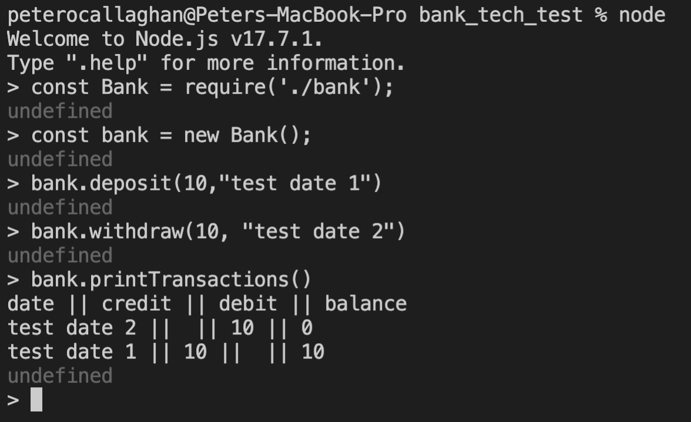

# How to run

After running Node, you can interact with the bank using the following commands:

### Setup
`const Bank = require('./bank');`
`const bank = new Bank();`

### Deposit money
`bank.deposit(10,"test date 1")`

### Withdraw money
`bank.withdraw(10, "test date 2")`

### Print all transactions
`bank.printTransactions()`

# Tests
Run the command `jest`

# Acceptance criteria

